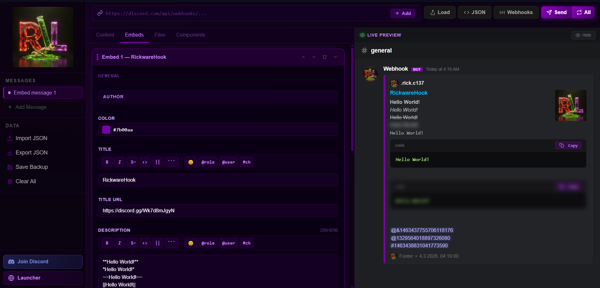
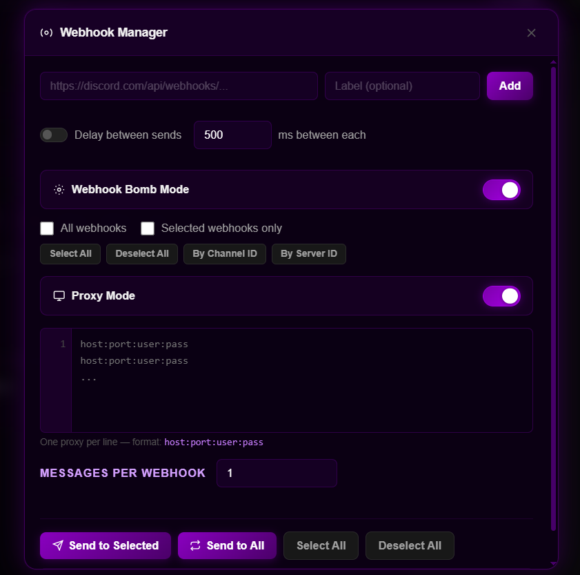

<div align="center">
  
</div>

<h1 align="center">RickwareHook</h1>

<div align="center">
  
</div>

<div align="center">
  
</div>

<br/>

<div align="center">
  A powerful, fully client-side Discord webhook message builder and sender.<br/>
  Build rich embeds, manage webhooks, and fire messages — all from the browser with zero backend.
</div>

---

## Table of Contents

- [Overview](#overview)
- [File Structure](#file-structure)
- [Getting Started](#getting-started)
- [Interface Layout](#interface-layout)
  - [Sidebar](#sidebar)
  - [Editor Panel](#editor-panel)
  - [Live Preview Panel](#live-preview-panel)
- [Message Configuration](#message-configuration)
  - [Webhook Settings](#webhook-settings)
  - [Message Content](#message-content)
  - [Embeds](#embeds)
    - [Author](#author)
    - [General](#general)
    - [Images](#images)
    - [Footer](#footer)
    - [Fields](#fields)
  - [Buttons](#buttons)
  - [Files](#files)
- [Format Toolbar](#format-toolbar)
- [Markdown Reference](#markdown-reference)
- [Emoji Support](#emoji-support)
- [Mention Insertion](#mention-insertion)
- [Multi-Message System](#multi-message-system)
- [JSON Editor](#json-editor)
- [Webhook Manager](#webhook-manager)
  - [Adding Webhooks](#adding-webhooks)
  - [Delay Between Sends](#delay-between-sends)
  - [Webhook Bomb Mode](#webhook-bomb-mode)
  - [Proxy Mode](#proxy-mode)
  - [Progress Tracking](#progress-tracking)
  - [Pause, Resume & Abort](#pause-resume--abort)
- [Data Management](#data-management)
- [Keyboard Shortcuts](#keyboard-shortcuts)
- [Responsive Design](#responsive-design)
- [Technical Notes](#technical-notes)

---

## Overview

RickwareHook is a fully client-side web application for composing, previewing, and sending Discord webhook messages. It requires no server, no accounts, and no API keys beyond your own Discord webhook URLs. Everything runs in your browser.

Key capabilities:

- Build Discord messages with rich embeds, custom authors, images, fields, and footers
- Real-time live preview that mirrors Discord's visual style
- Full Discord markdown rendering including code blocks, spoilers, mentions, and custom emoji
- Multi-message workspace — manage several payloads simultaneously
- Webhook manager with bulk send, Bomb Mode, and Proxy Mode
- Import and export raw Discord JSON payloads
- Backup and restore your entire workspace

---

## File Structure

```
RickwareHook/
├── index.html          Main application entry point
├── css/
│   └── main.css        All styles, glass effects, responsive breakpoints
├── js/
│   └── main.js         All application logic — zero dependencies
├── assets/
│   ├── logo.gif        Animated logo shown in sidebar and as default webhook avatar
│   └── 0.png           Website screenshot used in this README
└── README.md           This file
```

---

## Getting Started

No build step is required. Open `index.html` directly in any modern browser, or serve the folder via any static file server:

```bash
npx serve .
# or
python3 -m http.server 8080
```

The application is entirely self-contained. No npm install, no dependencies, no internet connection required after the first load (unless fetching webhook info or Discord CDN emoji).

---

## Interface Layout

The application is divided into three main zones:

### Sidebar

The left sidebar contains navigation and data management controls.

**Messages section** lists all active message tabs. Clicking a tab switches the editor and preview to that message. The `+ Message` button adds a new blank message.

**Data section** contains:

| Button | Action |
|---|---|
| Import JSON | Load a Discord JSON payload from a `.json` file |
| Export JSON | Download the current message as a Discord-compatible `.json` file |
| Save Backup | Download a full workspace backup including all messages and webhooks |
| Clear All | Wipe all messages and reset to a blank state |

At the bottom of the sidebar are two link buttons:

- **Join Discord** — Opens the community Discord server
- **Launcher** — Opens the associated launcher tool in a new tab

---

### Editor Panel

The main editing area in the center. It is tabbed into sections:

| Tab | Contents |
|---|---|
| Webhook | Webhook URL, username override, avatar URL, thread name |
| Content | Main message text with format toolbar and markdown hints |
| Embeds | All embed cards; add, reorder, delete |
| Buttons | Up to 5 link buttons attached to the message |
| Files | File attachments (up to 8 MB each) |

---

### Live Preview Panel

The right panel renders a real-time Discord-style preview of your message. It updates automatically as you type.

The preview shows:

- The webhook avatar (logo gif by default, or the actual webhook avatar if a URL has been entered and resolved)
- The webhook username (overridden name or resolved webhook name)
- The BOT badge in purple
- The message content with full markdown rendering
- All embeds with their color pills, authors, titles, descriptions, fields, images, and footers
- Link buttons in Discord's button style
- File attachment chips

The **Live Preview** label at the top is purple with a blinking green eye indicator to show the preview is active.

On narrow screens a floating **Show Preview** button appears to open the preview as a full-screen overlay.

---

## Message Configuration

### Webhook Settings

Found in the **Webhook** tab.

| Field | Description |
|---|---|
| Webhook URL | The full Discord webhook URL. Format: `https://discord.com/api/webhooks/{id}/{token}` |
| Username Override | Replaces the webhook's default display name for this message |
| Avatar URL | Replaces the webhook's default avatar for this message |
| Thread Name | Creates a new thread in a Forum or Text channel with this name |

When a valid webhook URL is entered, RickwareHook automatically fetches the webhook's metadata from Discord's API. The resolved name, avatar, and channel information update in the live preview automatically.

---

### Message Content

Found in the **Content** tab. Supports up to 2000 characters. A live character counter is shown.

The content field has a full format toolbar and a markdown hints strip below it. Clicking any hint in the strip inserts that formatting at the cursor.

---

### Embeds

Found in the **Embeds** tab. Up to 10 embeds can be added per message.

Each embed is a collapsible card with a colored left-border strip showing the embed color. The card header shows the embed number and title preview. Controls in the header allow reordering the embed up or down, deleting it, and collapsing or expanding it.

Inside each embed card there are four collapsible sections:

#### Author

Contains the author block displayed above the embed title.

| Field | How to reveal |
|---|---|
| Author Name | Always visible |
| Author URL | Click `+ Add Author URL` — makes the author name a clickable hyperlink |
| Author Icon URL | Click `+ Add Author Icon URL` — shows a small circular icon to the left of the author name |

#### General

Contains the main body fields of the embed.

| Field | Description |
|---|---|
| Color | Color swatch + hex input. Click the swatch to open the color picker. Default is purple (`#7b00aa`) |
| Title | Embed title, up to 256 characters |
| Title URL | Makes the title a clickable link |
| Description | Main embed text, up to 4096 characters. Supports full Discord markdown. The field is tall by default for comfortable editing |

The Title and Description fields each have a full format toolbar.

#### Images

| Field | Description |
|---|---|
| Thumbnail URL | Small image displayed top-right of the embed body |
| Image URL | Large image displayed below the embed description and fields |
| Additional Images | Up to 3 more image slots, revealed by clicking `+ Add Image` |

Each image field has a purple **Upload** button that lets you choose a local jpg, png, webp, or gif file. The file is encoded as base64 and embedded directly — no hosting required.

#### Footer

| Field | Description |
|---|---|
| Footer Text | Small text at the bottom of the embed |
| Footer Icon URL | Tiny circular icon to the left of the footer text |
| Timestamp | Toggle to include a timestamp. Defaults to the current time; you can also set a custom date/time |

#### Fields

Inline fields below the description. Up to 25 fields per embed.

Each field has a Name, a Value (supports markdown), and an **Inline** toggle. Inline fields are laid out side-by-side (up to 3 per row); non-inline fields each take the full width.

Fields can be reordered up/down and deleted individually.

---

### Buttons

Found in the **Buttons** tab. Up to 5 link buttons per message.

| Field | Description |
|---|---|
| Label | The button text |
| Emoji | Optional emoji prefix (standard Unicode emoji) |
| URL | The URL the button links to |

Buttons appear in the live preview as styled Discord link buttons.

---

### Files

Found in the **Files** tab. Drag and drop files onto the dropzone or click to browse. Maximum 8 MB per file. Files appear as attachment chips in the preview and are included in the payload when sent.

---

## Format Toolbar

A toolbar appears above the Message Content, embed Title, and embed Description fields. It provides one-click formatting.

**Text wrapping buttons** — select text first, then click to wrap. Clicking again with the same text selected removes the formatting (toggle behavior):

| Button | Markdown | Output |
|---|---|---|
| **B** | `**text**` | Bold |
| *I* | `*text*` | Italic |
| S̶ | `~~text~~` | Strikethrough |
| `<>` | `` `text` `` | Inline code |
| `\|\|` | `\|\|text\|\|` | Spoiler / blur |
| ` ``` ` | ` ```text``` ` | Code block |

**Insert buttons** — insert content at the cursor position:

| Button | Action |
|---|---|
| 😊 | Opens the emoji picker |
| @role | Prompts for a Role ID and inserts `<@&id>` |
| @user | Prompts for a User ID and inserts `<@id>` |
| #ch | Prompts for a Channel ID and inserts `<#id>` |

---

## Markdown Reference

RickwareHook renders Discord-compatible markdown in the live preview:

| Syntax | Renders As |
|---|---|
| `**text**` | **Bold** |
| `*text*` or `_text_` | *Italic* |
| `***text***` | ***Bold Italic*** |
| `~~text~~` | ~~Strikethrough~~ |
| `` `code` `` | Inline code |
| ` ```code``` ` | Code block with copy button |
| `\|\|text\|\|` | Spoiler (blurred, hover to reveal) |
| `[label](url)` | Hyperlink |
| `* item` | Bullet list |
| `  * sub` | Nested bullet list |
| `@everyone` / `@here` | Mention highlight |
| `<@userId>` | User mention |
| `<@&roleId>` | Role mention |
| `<#channelId>` | Channel mention |

Code blocks in the preview include a **Copy** button in the top-right corner. Clicking it copies the code content to the clipboard and briefly shows "Copied!".

Spoiler text is blurred by default and revealed on hover.

---

## Emoji Support

The emoji picker contains 500+ standard Unicode emojis organized into seven categories: Smileys, People, Animals, Food, Travel, Objects, and Symbols. Use the search bar to filter by name.

Custom Discord emoji are also supported directly in text fields:

| Format | Type | Renders As |
|---|---|---|
| `<:name:id>` | Static custom emoji | Fetched from Discord CDN as a PNG |
| `<a:name:id>` | Animated custom emoji | Fetched from Discord CDN as a GIF |

Both formats are rendered inline in the live preview at text height.

---

## Mention Insertion

Click the `@role`, `@user`, or `#ch` buttons in any format toolbar to open the mention dialog. Enter the Discord ID and click Insert. The correct mention syntax is inserted at the cursor:

| Type | Inserted syntax |
|---|---|
| Role | `<@&ROLE_ID>` |
| User | `<@USER_ID>` |
| Channel | `<#CHANNEL_ID>` |

---

## Multi-Message System

RickwareHook supports multiple independent message payloads in one session. Use the **Messages** section in the sidebar to switch between them.

Each message has its own content, embeds, buttons, files, and webhook settings. Switching messages updates both the editor and the live preview instantly.

Use the `+ Message` button to add a new blank message. Messages are preserved in session memory — use Save Backup to persist across sessions.

---

## JSON Editor

Access the raw JSON editor via the `{}` button in the top bar or the keyboard shortcut `Ctrl+E`.

The editor shows the current message as a formatted Discord webhook payload JSON. You can directly edit the JSON, then click **Apply** to load it into the editor.

Additional controls in the JSON editor:

| Button | Action |
|---|---|
| Import | Load a `.json` file directly into the editor |
| Format | Auto-format / pretty-print the JSON |
| Validate | Check if the current JSON is valid (shows a success or error toast) |
| Apply | Parse the JSON and update the visual editor and preview |

You can also use **Load Message** (the folder icon in the top bar) to paste a raw JSON payload into a textarea and load it.

---

## Webhook Manager

Open the Webhook Manager via the **Webhooks** button in the top bar, or via the Manage Webhooks link in the webhook area.

### Adding Webhooks

Paste a Discord webhook URL into the URL field. Optionally give it a label. Click **Add** or press Enter. Added webhooks appear in the list below with a checkbox, label, URL preview, and last-send status.

Each webhook can be individually selected or deselected via its checkbox.

### Delay Between Sends

Enable the **Delay between sends** toggle and set a value in milliseconds (0–10,000). When active, RickwareHook waits this duration between each webhook send request, useful to avoid rate limits when sending to many webhooks.

---

### Webhook Bomb Mode

The **Webhook Bomb Mode** toggle (purple switch, default off) enables mass message sending.

When enabled, additional controls appear:

**Target selection** — two mutually exclusive checkboxes:
- **All webhooks** — sends to every webhook in the list
- **Selected webhooks only** — sends only to checked webhooks

Switching one automatically unchecks the other.

**Bulk selection actions:**

| Button | Action |
|---|---|
| Select All | Checks all webhooks in the list |
| Deselect All | Unchecks all webhooks |
| By Channel ID | Enter a Discord Channel ID — selects all webhooks whose URL matches that channel |
| By Server ID | Enter a Discord Server/Guild ID — selects matching webhooks |

After clicking By Channel ID or By Server ID, a filter input appears inline. Enter the ID and click **Apply** to perform the selection.

**Messages per webhook** — a number field (1 to 999,999,999). In Bomb Mode, this many copies of the current message payload will be sent to each targeted webhook in sequence.

---

### Proxy Mode

The **Proxy Mode** toggle (purple switch, default off) enables per-request proxy rotation.

When enabled, a textarea appears for entering residential proxies, one per line, in the format:

```
host:port:user:pass
```

Line numbers are shown to the left of the textarea. When Proxy Mode is active, each outgoing webhook request cycles through the proxy list in order. The proxy index wraps around when the end of the list is reached.

> **Note:** Browser `fetch()` does not natively support HTTP proxy routing. Proxy Mode is designed for environments where a local proxy agent or browser extension intercepts fetch calls and applies the configured proxy. In a standard browser context, the proxy field functions as a reference for external tooling.

---

### Progress Tracking

While a send operation is in progress, a progress section appears in the Webhook Manager:

| Element | Description |
|---|---|
| Progress bar | Animated purple gradient bar showing completion percentage |
| Percentage | Live percentage of messages sent vs total |
| Sent counter | Exact count of successfully sent messages |
| Total counter | Total number of messages to be sent |
| Data usage | Cumulative estimated payload size sent through proxies, displayed in B / KB / MB |

All values update in real time after each individual message send.

---

### Pause, Resume & Abort

Three control buttons appear during an active send:

| Button | Action |
|---|---|
| Pause | Halts the send loop after the current in-flight request completes. The resume button appears. |
| Resume | Continues the send loop from where it paused. |
| Abort | Immediately flags the operation for cancellation. The current in-flight request finishes and then the loop exits. A toast confirms the abort. |

---

## Data Management

| Action | Details |
|---|---|
| **Export JSON** | Downloads the current message payload as a standard Discord webhook JSON file |
| **Import JSON** | Loads a Discord webhook JSON file into the current message, replacing its content |
| **Save Backup** | Downloads a full backup of all messages and all webhook URLs/labels as a single JSON file |
| **Clear All** | After confirmation, deletes all messages and resets to a single blank message |
| **Load Message** | Paste-in raw JSON to load into the current message slot |

Backups include version metadata and a timestamp and can be used to restore a full session by importing each message payload manually.

---

## Keyboard Shortcuts

| Shortcut | Action |
|---|---|
| `Ctrl + Enter` | Send the current message to the active/configured webhook |
| `Ctrl + E` | Open the raw JSON editor |
| `Escape` | Close any open modal (JSON editor, Load Message, Webhook Manager, Emoji Picker, Mention dialog) |

---

## Responsive Design

RickwareHook is fully responsive across all screen sizes:

| Breakpoint | Behavior |
|---|---|
| > 1280px | Full layout — sidebar + editor + 630px preview panel |
| 1100–1280px | Preview panel narrows to 480px |
| 960–1100px | Preview panel narrows to 380px |
| 820–960px | Preview panel narrows to 340px |
| < 820px | Preview panel hidden by default; floating **Show Preview** button appears; tap to open as full-screen overlay |
| < 700px | Sidebar narrows; top bar buttons compress |
| < 600px | Sidebar hidden; single-column layout; modals use full width |
| < 400px | Button labels hidden; icon-only top bar |

---

## Technical Notes

- **Zero dependencies** — the entire application is vanilla HTML, CSS, and JavaScript. No frameworks, no npm packages, no CDN scripts.
- **No backend** — all processing is client-side. Nothing is transmitted except to Discord's webhook API directly from the browser.
- **No storage** — session data lives in JavaScript memory only. Use Save Backup to persist data between sessions.
- **Webhook info fetching** — when a webhook URL is typed, RickwareHook calls Discord's API (`GET /api/webhooks/{id}/{token}`) to retrieve the webhook's name, avatar, and channel. This is a read-only, unauthenticated call using the webhook token.
- **Image uploads** — uploaded images are converted to base64 data URIs and embedded in the payload. This is suitable for preview purposes; Discord's API does not accept base64 in the `image.url` field for production sends. For actual sending, host the image externally and paste its URL.
- **Rate limiting** — the send loop handles Discord's 429 rate limit responses automatically by reading the `retry_after` value and waiting the specified duration before retrying (up to 3 attempts per webhook).
- **Font** — the entire interface uses Arial / Helvetica for system-native rendering.
- **Color scheme** — deep purple and black glass aesthetic throughout, with `backdrop-filter: blur()` panels, purple glow hover effects, and a Discord-accurate preview theme.

---

## Support

Found a bug or security vulnerability?

- Join the Discord community: [discord.com/invite/Wk7d8mJgyN](https://discord.com/invite/Wk7d8mJgyN)
- Open a support ticket in the server
- Or DM the developer directly: **@.rick.c137**

> Please report security vulnerabilities **privately** via DM before opening any public issue.

---

*Developed by .rick.c137*
